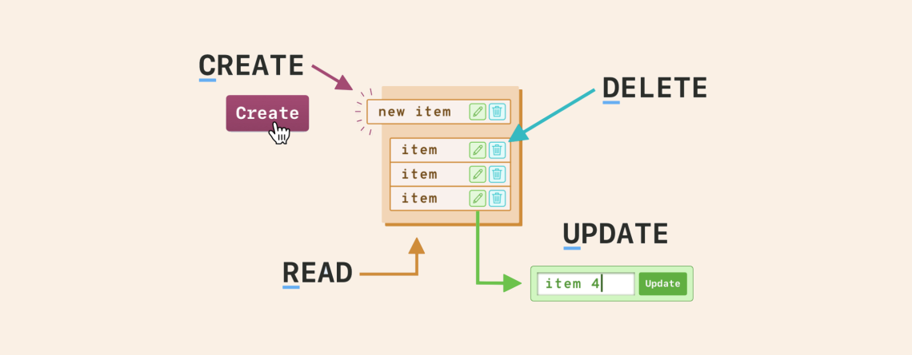

# Solana CRUD dApp



A full-stack decentralized application built with Solana, Anchor, and Next.js that demonstrates basic CRUD (Create, Read, Update, Delete) operations.

## 📋 Prerequisites

- Node.js 16+ and npm
- [Rust](https://rustup.rs/)
- [Solana Tool Suite](https://docs.solana.com/cli/install-solana-cli-tools)
- [Anchor](https://www.anchor-lang.com/docs/installation)
- [Phantom Wallet](https://phantom.app/) (or another Solana wallet)

## 🚀 Quick Start

### 1. Clone the Repository

```bash
git clone https://github.com/fornitechibi/CRUD-DApp-Solana.git
cd CRUD-DApp-Solana
```

### 2. Install Dependencies

````bash
# Install program dependencies
npm install

### 3. Configure Your Local Environment

```bash
# Set up Solana to use localhost
solana config set --url localhost

# Create a new keypair if you don't have one
solana-keygen new

# Start the local Solana cluster
solana-test-validator

# Airdrop SOL to your wallet (in a new terminal)
solana airdrop 2
````

### 4. Build and Deploy the Program

```bash
cd anchor
# In the program directory
anchor build
anchor deploy
# Update the program ID in Anchor.toml and lib.rs
anchor keys sync
```

### 5. Start the Frontend

```bash
# In the app directory
npm run dev
```

Visit `http://localhost:3000` to interact with your dApp.

## 🧪 Testing

### Program Tests

```bash
# In the program directory
anchor test
```

### Frontend Tests

```bash
# In the app directory
npm test
```

## 🛠 Common Issues & Solutions

### 1. "Not Enough SOL" Error

If you encounter this error while testing:

```bash
# Airdrop more SOL
solana airdrop 5 <your-wallet-address> --url localhost
```

### 2. Program Deployment Issues

If you face deployment problems:

```bash
# Reset your local validator
solana-test-validator --reset

# Clean and rebuild
anchor clean
anchor build
anchor deploy
```

### 3. Phantom Wallet Connection Issues

Ensure you:

- Are connected to the correct network (localhost)
- Have proper RPC URL configuration
- Have sufficient SOL balance

## 📁 Project Structure

```
├── program/                # Anchor program files
│   ├── programs/          # Program source code
│   ├── tests/             # Program tests
│   └── Anchor.toml        # Anchor configuration
├── app/                   # Next.js frontend
│   ├── src/
│   │   ├── app/   # React components
│   │   ├── components/        # Next.js pages
│   │
│   └── tests/            # Frontend tests
└── README.md
```
